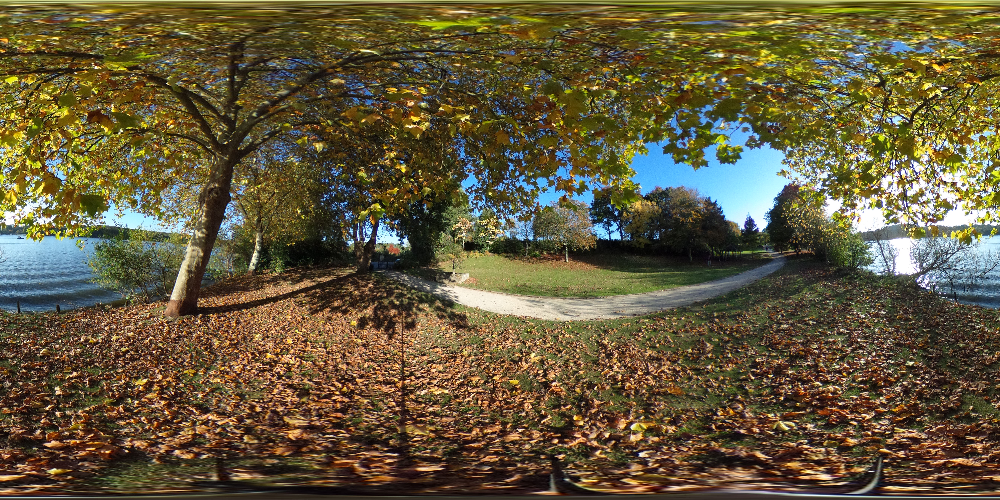
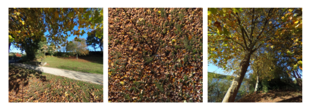
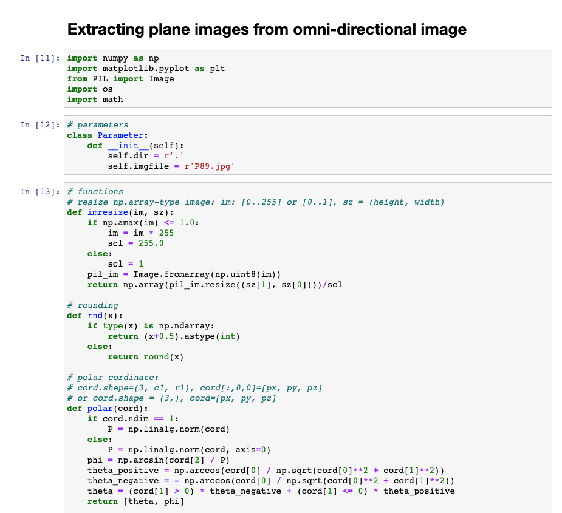

# odi-processing
Jupyter notebook for extracting plane images from omni-directional image

Extracted Images  

# Usage
Download files in this repogitory, open 'extracting_planeimage_from_odi.ipynb' in jupyter notebook, and run each cell.

